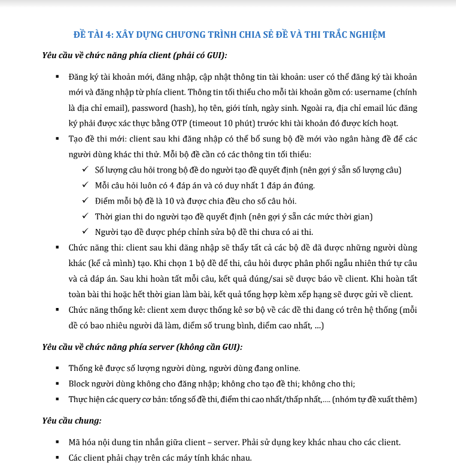
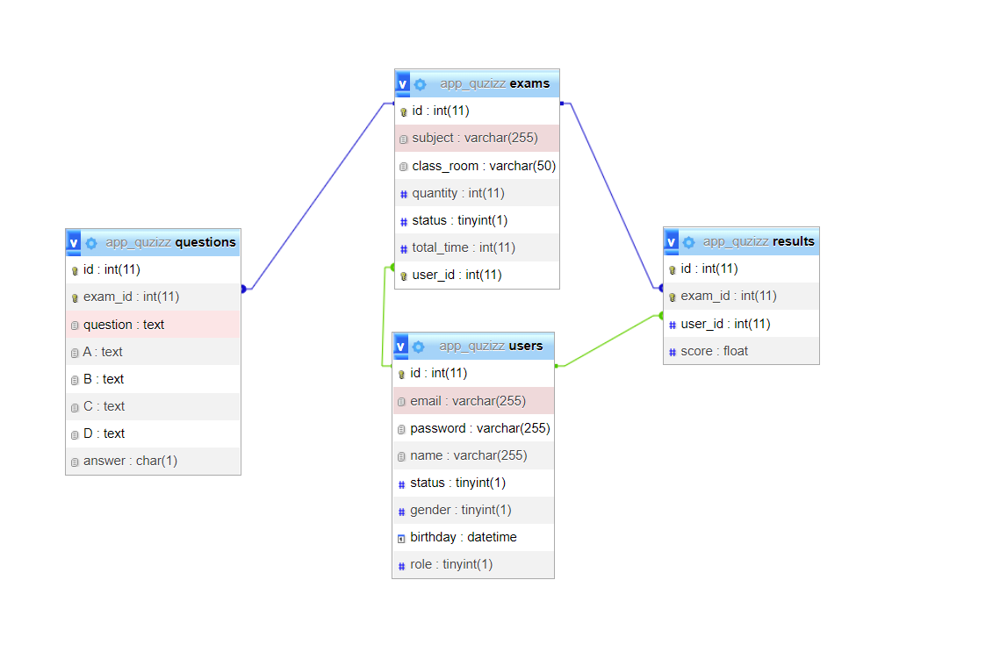

# Project: Thi Trắc Nghiệm

## 1. Cấu Trúc Prject

## Yêu Cầu Project



## 2. Công Nghệ Sử Dụng

```
TCP Socket
Mã hoá lai

```

## Database



## 3. Cài Đặt

## Mô Tả

### 1. Chức Năng Thi

```
- Lưu và tính hạn khi hết câu hỏi hoặc hết thời gian.
- Thoát sẽ không lưu kết quả.
```
